# VAJRA — Final SIH Implementation Scope & Architecture Blueprint

## 1. Executive Summary & One-Sentence Definition

> **VAJRA** is an explainable, multi-chain blockchain forensic intelligence platform that does not merely flag suspicious wallets; it identifies related entities, recognizes behavioral patterns, reconstructs fund flows, connects cross-chain activity, discovers fraud campaigns, produces evidence-backed risk assessments, and assists investigators through conversational, natural-language AI copilots operating over a cryptographically verifiable claim-centric evidence model.

---

## 2. Core Architecture Topology

```mermaid
flowchart TD
    subgraph UI_Investigation [Investigation & User Experience Layer]
        Copilot[VAJRA AI Investigator<br/>Natural-Language Copilot]
        NLQuery[NL Blockchain Query Engine]
        EvidenceUI[Claim-Centric Evidence Vault]
        SearchUI[Multi-Dimensional Search]
        CaseUI[Audit-Ready Case Manager]
    end

    subgraph IntelligenceGraph [VAJRA Intelligence Graph Engine]
        UnifiedGraph[(Unified Identity & Fund Graph)]
        EntityCluster[Entity & Ownership Clustering]
        CrossChainGraph[Cross-Chain Linkage Graph]
        TemporalGraph[Temporal Layered Subgraphs]
    end

    subgraph AnalyticalEngines [Analytical & Inference Engines]
        RiskEngine[Risk Engine 2.0<br/>Multi-Dimensional DNA]
        BehaviorEngine[Behavioral Signatures & Typology Engine]
        AttributionEngine[VASP & Entity Attribution Engine]
        PathEngine[Dynamic Configurable Path Engine]
        CampaignEngine[Fraud Campaign & Shared-Funder Engine]
        PredictionEngine[Predictive Next-Hop & Off-Ramp Engine]
        ThreatIntel[Threat & Sanctions Intelligence Engine]
    end

    subgraph IngestionMLData [Data Ingestion, ML & Provenance Pipeline]
        ChainData[Multi-Chain Ingestion: ETH, BTC, BSC, TRON, SOL, POL, ARB, BASE, OP, AVAX]
        DataNorm[Transaction Normalization Layer]
        FeatureStore[(Centralized Feature Store)]
        MLModels[Next-Gen Typology ML Models<br/>Scam, Mule, Layering, Anomaly]
        StorageLayer[(PostgreSQL Case DB + Neo4j Graph + Redis Cache)]
        CryptographicProof[SHA-256 Hash Seal & Chain-of-Custody]
    end

    UI_Investigation <--> IntelligenceGraph
    IntelligenceGraph <--> AnalyticalEngines
    AnalyticalEngines <--> IngestionMLData
```

---

## 3. The 21 Core Implementation Pillars

### Pillar 1: Entity & Identity Intelligence
* **Multi-Address Entity Clustering**: Group multiple wallet addresses controlled together into unified operational clusters.
* **Wallet Ownership Clustering**: Common-control confidence estimation based on observable on-chain heuristics (e.g., common spending, co-deposits).
* **Behavioral Fingerprinting**: Velocity, fan-out, holding time, cross-chain propensity, timing intervals.
* **Cross-Chain Identity Resolution**: Connect addresses across chains (e.g., Ethereum $\rightarrow$ Bridge $\rightarrow$ Arbitrum $\rightarrow$ Tron).
* **Entity Confidence Scoring**: Separate relationship certainty (e.g., 91%) from fraud risk (e.g., 85%).
* **VASP Attribution**: Evidence-driven exchange and institutional wallet attribution.
* **Exchange Deposit-Address Clustering**: Connect single-use deposit wallets to parent exchange hot/cold wallet infrastructures.
* **Relationship Graph**: Edge types: `funds`, `receives`, `consolidates`, `forwards`, `bridges`, `swaps`, `interacts-with`, `associated-with`.

### Pillar 2: Advanced Behavioral Intelligence
* **Behavioral Signatures Engine**: Detect composite patterns (Receive $\rightarrow$ Split $\rightarrow$ Forward $\rightarrow$ Recombine).
* **Money-Laundering Typologies**: Sequence-level analysis of multi-step movement.
* **Peel-Chain Detection**: Identify incremental skimming and systematic forwarding.
* **Layering & Structuring**: Multi-hop dispersion, repeated equal/near-equal sub-threshold amounts.
* **Fan-In / Fan-Out Automation**: Automatic identification of consolidation hubs and dispersion points.
* **Rapid Movement & Lifecycle Analysis**: Explicit holding time modeling; creation $\rightarrow$ activation $\rightarrow$ dormancy tracking.
* **Anomaly Detection**: Unsupervised deviation scoring from baseline cohort behavior.

### Pillar 3: Scam & Fraud Intelligence
* **Scam & Collection Wallets**: Identify mass victim aggregation points and multi-tier mule networks.
* **Investment Scam & Phishing Structures**: Many-to-one inflow patterns followed by rapid bridging/cashing out.
* **Rug-Pull Analysis**: Liquidity injection, artificial volume pump, abrupt liquidity removal.
* **Campaign Detection**: Group isolated wallets into named, coordinated fraudulent campaigns with distinct operational roles.

### Pillar 4: Advanced Money-Flow Analysis
* **Dynamic Path-Finding Engine**: Configurable hops ($1 \dots N$), minimum value, time windows, specific token assets, and risk thresholds.
* **Multi-Path & Value-Weighted Ranking**: Discover all alternative routes and prioritize high-value channels.
* **Time-Constrained & Asset Tracing**: Filter forensic timeline by block/timestamp intervals and asset conversions.
* **Circular Flow Detection**: Identify cyclic transfers ($A \rightarrow B \rightarrow C \rightarrow D \rightarrow A$).

### Pillar 5: Cross-Chain Intelligence
* **Native Cross-Chain Tracing**: Continuous investigation flow through bridges (Stargate, Hop, Multichain, TronBridge, etc.).
* **Chain-Hopping Reconstruction**: Correlate bridge entry locks/burns with corresponding destination mints/releases.
* **Cross-Chain Risk Propagation**: Compute upstream/downstream risk spillover across chains.

### Pillar 6: DeFi Intelligence
* **DEX Swap Decoding**: Parse Uniswap, PancakeSwap, Curve, Sushi swap routing and liquidity pool interactions.
* **Smart Contract Risk Attribution**: Classify protocols into DEX, Bridge, Lending, Token, Mixer, or Malicious.
* **DeFi Layering Detection**: Track swaps used as intermediate obfuscation steps.

### Pillar 7: Mixer & Privacy Intelligence
* **Direct & Indirect Mixer Exposure**: Calculate hop distance, value exposure, and timing correlation to privacy pools (Tornado Cash, CoinJoin, Railgun).
* **Mixer Entry/Exit Correlation**: Statistical matching of deposit time/amount distributions to withdrawal events.
* **Privacy-Enhanced Tracing**: Explicit uncertainty boundaries when privacy pools obscure deterministic linkability.

### Pillar 8: Advanced Graph Intelligence
* **Temporal & Dynamic Entity Graph**: Time-sliced graph views combining wallet, entity, contract, and case layers.
* **Community Detection & Centrality**: Louvain/Leiden modularity clustering, PageRank, betweenness, and bottleneck identification.
* **Suspicious Subgraph Matching**: Graph isomorphism matching against catalogued money laundering templates.

### Pillar 9: Next-Generation ML
* **Typology-Specific ML Models**: Separate lightweight classifiers for Scam, Mule, Layering, and Anomaly detection.
* **Ensemble Risk Scoring**: Synthesize rule heuristics, graph metrics, ML inferences, and threat intelligence.
* **Explainable ML (XAI)**: Feature contribution breakdown (e.g., $+25\%$ Fan-out, $+30\%$ Mixer exposure, $+15\%$ Velocity).

### Pillar 10: Intelligence & External-Signal Layer
* **Sanctions & Watchlist Sync**: Real-time matching against OFAC, UN, and national cyber crime registries.
* **OSINT & Public Reports**: Integration with verified scam reporting repositories and token risk registries.

### Pillar 11: Temporal Intelligence
* **Fund-Flow Time Machine**: Historical point-in-time state reconstruction of the transaction network.
* **Velocity & Burst Modeling**: Rate of value transmission ($V = \Delta \text{Value} / \Delta t$).
* **Risk Evolution Tracking**: Historical risk trajectory over days, weeks, or months.

### Pillar 12: Risk Engine 2.0
* **Multi-Dimensional Risk Vector**:
  $$\vec{R} = \langle R_{\text{AML}}, R_{\text{Scam}}, R_{\text{Mixer}}, R_{\text{Network}}, R_{\text{Behavioral}}, R_{\text{CrossChain}} \rangle$$
* **Confidence vs Risk**: Independent confidence score ($C \in [0, 100\%]$) distinguishing evidence strength from risk severity.
* **Dynamic Exposure Propagation**: Attenuation-based risk transfer across network distance.

### Pillar 13: Evidence & Investigation
* **Claim-Centric Evidence Model**: Every evidence artifact explicitly backs a specific forensic claim.
* **Chain-of-Custody & Provenance**: Timestamps, source APIs, execution parameters, SHA-256 tamper-evident sealing.
* **Alternative Hypothesis Engine**: Contrast malicious hypothesis vs. legitimate operational hypothesis (e.g., market maker, treasury sweep).
* **Audit-Ready Court Dossiers**: Instant one-click PDF/JSON export for law enforcement and compliance.

### Pillar 14: AI Investigation Layer
* **Conversational AI Copilot**: Context-aware natural-language investigation assistant.
* **NL Blockchain Querying**: Translate investigator questions into structured graph and transaction queries.
* **AI Path & Typology Explainer**: Plain-English narrative breakdown of complex transaction chains.
* **Counter-Hypothesis Evaluation**: Automated false-positive reduction via legitimate business-case testing.

### Pillar 15: Predictive Intelligence
* **Next-Hop & Destination Prediction**: Probability distribution over likely next steps (Exchange, Bridge, Mixer, DEX).
* **Off-Ramp & Risk Escalation Warning**: Early alert when funds converge toward fiat off-ramps or higher-tier laundering infrastructure.

### Pillar 16: Campaign-Level Intelligence
* **Campaign Discovery**: Cluster multiple seemingly disconnected cases sharing root infrastructure or funding sources.
* **Shared-Funder & Shared-Destination Analytics**: Detect common genesis wallets and cashing-out hubs.

### Pillar 17: Real-Time Intelligence
* **Live Wallet & Entity Watchlists**: Continuous background monitoring for registered addresses.
* **Event-Driven Alerting**: Instant notifications on threshold breaches, bridge crossings, or mixer interactions.

### Pillar 18: Advanced Search
* **Multi-Modal Search Engine**: Query by address, entity, natural-language phrase, behavioral profile, or graph structure.
* **Reverse Flow Search**: Trace backward from destination/exchange deposit to identify origin fund sources.

### Pillar 19: Novel VAJRA Differentiators
* **Explainable Risk DNA & Wallet Behavioral DNA**: Standardized, human-readable genetic signatures for wallet behavior.
* **Blockchain Crime Genome**: Reusable fingerprint catalog for known laundering and fraud typologies.
* **Risk Propagation Simulator**: Interactive "what-if" testing to observe network impact of altering entity labels.
* **Collective Case Knowledge Graph**: Cross-case intelligence correlation across independent investigations.

### Pillar 20: Architecture & Engineering
* **Storage Tier**: PostgreSQL (case, evidence, users, audit logs), Neo4j (graph topology & traversal), Redis (caching & session state).
* **Data Lake & Feature Store**: Normalized multi-chain transaction repository with reusable feature compute pipelines.
* **Security & Governance**: Role-Based Access Control (RBAC), immutable forensic audit logs, cryptographic verification.

### Pillar 21: Ultimate VAJRA Platform
* **Unified Analytical Engine**: Seamless orchestration of all 20 pillars into a single, cohesive, production-grade forensic intelligence workstation.
